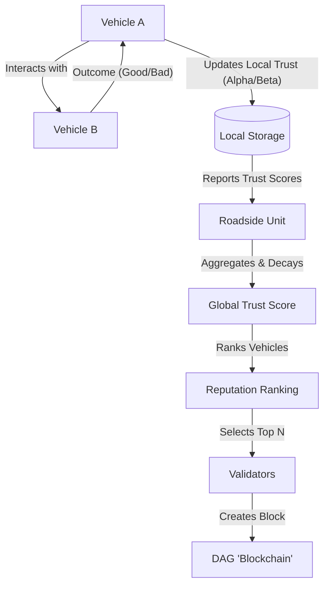

# IoV Trust Management Prototype - Comprehensive Documentation

**Date:** January 23, 2026  
**Author:** GitHub Copilot (on behalf of User)

---

## 1. Executive Summary & Session Report

### What We Built

In this session, we built a complete, functional **Research Prototype** for a Trust Management System in the Internet of Vehicles (IoV) domain. The goal was to simulate how vehicles can evaluate each other's trustworthiness using a **Bayesian Trust Model** and how highly trusted vehicles can be selected to secure a network (represented by a mocked **blockchain**).

### Key Achievements

1. **Architecture Setup**: Created a clean, modular Python project structure.
2. **Trust Logic**: Implemented the Beta Reputation System (Bayesian mathematics) to calculate trust scores based on vehicle interactions.
3. **Simulation Engine**: Built a simulator that runs time-stepped interaction cycles between vehicles.
4. **Adversary Modeling**: Implemented three types of vehicle behaviors to test resilience:
    - **Honest**: 99% cooperation rate.
    - **Malicious (Constant)**: 20% cooperation rate (always bad).
    - **Swing Attacker**: Smart attacker that oscillates between good and bad behavior to trick the system.
5. **Blockchain Mock**: Created a DAG (Directed Acyclic Graph) structure to store trust updates, managed by "Validators" selected based on their reputation.
6. **Analysis Tools**: Integrated `matplotlib` to generate graphs showing trust evolution and detection accuracy ($TPR$ vs $FPR$).

---

## 2. Conceptual Architecture

This prototype is based on the following flow of information:



### Core Concepts Explained

#### A. Bayesian Trust (Alpha & Beta)

Instead of a simple "rating", we use probability.

- $\alpha$ (Alpha): Count of **positive** (cooperative) interactions (+1 for prior).
- $\beta$ (Beta): Count of **negative** (malicious) interactions (+1 for prior).
- **Trust Score**: The probability that the next interaction will be good.
    $$ T = \frac{\alpha}{\alpha + \beta} $$
    Example: 9 good, 1 bad $\rightarrow \alpha=10, \beta=2 \rightarrow T = 10/12 = 0.83$.

#### B. The Forgetting Factor

Trust shouldn't be permanent. Old behavior is less relevant than new behavior. The **Roadside Unit (RSU)** applies a "forgetting factor" (e.g., 0.95) when aggregating scores. This means yesterday's reputation matters slightly less than today's.

#### C. Validators & The DAG

We "mock" the blockchain. Instead of doing complex cryptography (Mining/Proof-of-Work), we simulate the *result* of a blockchain.

1. **Selection**: Only vehicles with the highest Global Trust are allowed to write to the ledger.
2. **DAG (Directed Acyclic Graph)**: Trust updates are stored in a graph structure, which is more scalable for IoV than a linear chain.

---

## 3. Codebase Walkthrough

Here is a guide to the files in the project root:

### 📂 `trust/` (The Brains)

- **`models/strategies.py`**: **(New)** logic core. Separate classes for `Proposed` vs `Baseline` models.
- **`bayesian.py`**: Pure math functions. specific implementations of the trust formula.
- **`vehicle.py`**: The `Vehicle` class. It stores its own history (`interactions`) and decides how to behave.
- **`rsu.py`**: The central aggregator. Now minimal; delegates math to strategies.

### 📂 `blockchain/` (The Ledger)

- **`dag.py`**: A **Trust-Weighted** DAG. Stores blocks and tracks **Cumulative Weight (TCW)**.
- **`consensus_manager.py`**: Managing module that links Trust scores to DAG construction.
- **`block.py`**: Defines "Block" with `issuer_trust` and `tcw`.

### 📂 `experiments/` (The Laboratory)

- **`run_experiment.py`**: **Run this file.** Supports `--sumo` and `--compare` flags.
- **`run_sumo_experiment.py`**: SUMO TraCI integration logic.
- **`plots.py`**: Utilities to draw the "Trust Evolution" and "Detection Metrics" graphs.

---

## 4. Execution Guide (Beginner Friendly)

### Prerequisites

- **Python 3.8+**
- **Eclipse SUMO** (optional, for Mobility mode)

### Step 1: Install Dependencies

```powershell
pip install -r requirements.txt
```

### Step 2: Run the Experiment (Two Modes)

**Mode A: Random Simulation (Fast)**
```powershell
python experiments/run_experiment.py
```

**Mode B: Realistic Mobility (SUMO)**
```powershell
python experiments/run_experiment.py --sumo
```
*(Ensure SUMO_HOME is set in your environment variables)*

### Step 3: Interpret the Output

1. **Console Logs**: You will see logs indicating the current simulation step and which vehicle ID is currently the "Top Validator".
    - *Example: "Step 20: Top Validator = V017"*
2. **Results Folder**: Navigate to `results/`.
    - **`trust_evolution.png`**: Open this image.
        - **Green Lines**: Honest vehicles. Should trend towards 1.0 (High Trust).
        - **Red Lines**: Malicious vehicles. Should trend towards 0.0 or 0.2 (Low Trust).
        - **Swing Attackers**: You might see lines that go up and down (zigzag).
    - **`detection_metrics.png`**: Shows the TPR (True Positive Rate) vs FPR (False Positive Rate). A high TPR and low FPR means the system is working well.

---

## 5. Modifying the Experiment

Want to change the scenario? Edit `experiments/run_experiment.py`:

```python
# Change number of vehicles or attackers
sim = Simulator(num_vehicles=50, percent_malicious=0.20, percent_swing=0.10)

# Change duration
SIMULATION_STEPS = 100
```

Want to change how smart the attackers are? Edit `trust/vehicle.py`:

- Look for `perform_action` method. You can change the probabilities there.

---

## 6. Future: SUMO Integration

Currently, vehicles interact randomly (`trust/simulator.py`).
To use real mobility data:

1. Install **Eclipse SUMO**.
2. Generate net/route files in `sumo/`.
3. Use the logic in `experiments/run_sumo_experiment.py` to replace the random loop in `run_experiment.py`.
